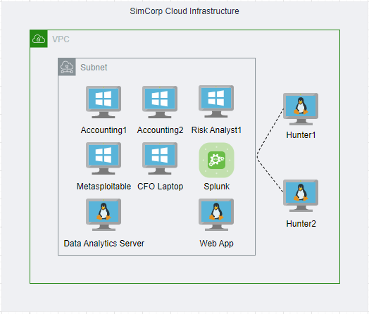
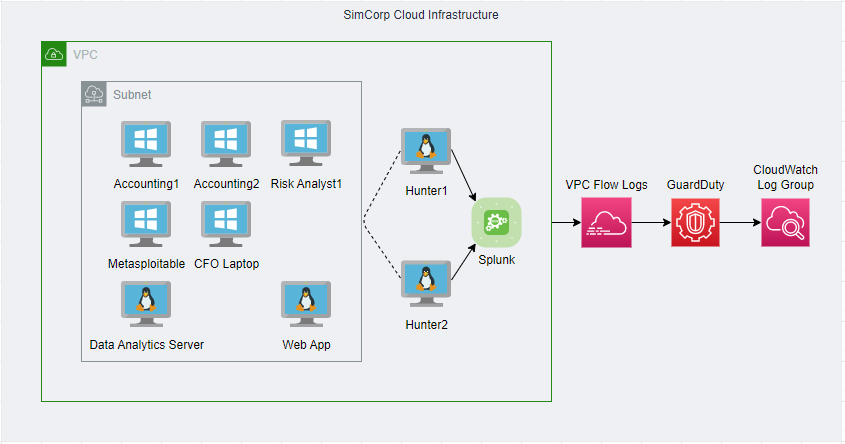

# BlueTeam
To hold documentation related to the Adversarial Emulation Engagement

## Topologies

## Slides

[Google Slides Deck](https://docs.google.com/presentation/d/1AjfG837798o6j32gbFC0pBc5tE_cKdmicnvRuRGN03U/edit#slide=id.g8526846ab1_1_42)